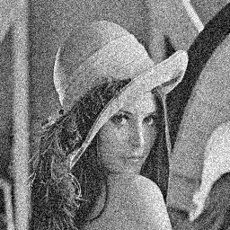
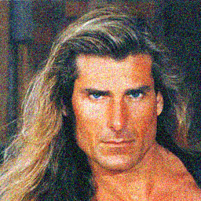
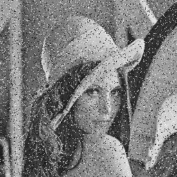
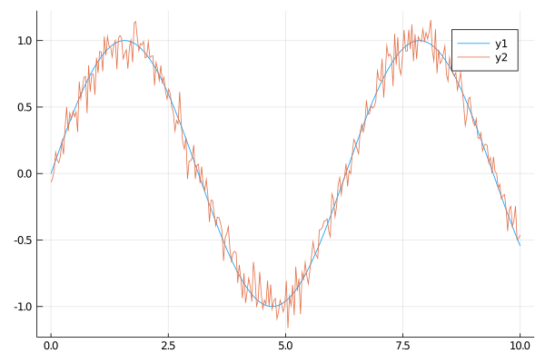

# Noise.jl
Julia package to add different kinds of noise to a digital signal like time series or images.
This repository is work in progress.

| **Documentation**                       | **Build Status**                          | **Code Coverage**               |
|:---------------------------------------:|:-----------------------------------------:|:-------------------------------:|
| [![][docs-stable-img]][docs-stable-url] | [![Build Status][travis-img]][travis-url] | [![][coveral-img]][coveral-url] |
| [![][docs-dev-img]][docs-dev-url]       | [![Build Status][appvey-img]][appvey-url] | [![][codecov-img]][codecov-url] |


## Documentation
The complete manual of `Noise.j` is available at [the documentation page][docs-stable-url].
It has more detailed explanation of the methods used and the examples for data arrays and images.


## Installation
`Noise.jl` is available for all version equal or above Julia 1.0. It is mainly tested under Linux but should also work on Windows.
It and can be installed with the following command

```julia
julia> Pkt.update()
julia> Pkg.add("Noise")
```
    
## Usage
Currently, all methods are not working in place and return always a new array.
In general, if images like `Array{RGB{<:Normed}` `Array{Gray{<:Normed}}` are given to a method, a new image with same type will be returned.
The methods also work for normal Arrays like `Array{<:Number}`.
At the moment three different types of noise are possible: Additive white Gaussian, Salt and Pepper and Poisson noise.

```@example
using Noise, TestImages, Images, Plots
img = testimage("lena_gray_256")
img_color = testimage("lena_color_256")

img_gray_gauss = additive_white_gaussian(img, 0.1)
img_color_gauss = additive_white_gaussian(img_color, 0.1)
img_gray_sp = salt_pepper(img, 0.1)

# 1D array
x = LinRange(0.0, 10.0, 300)
y = sin.(x)
# small noise
y_noise = additive_white_gaussian(y, 0.1)


plot(x,y) # hide
plot!(x, y_noise) # hide
savefig("images/series_index.png") # hide

save("images/img_gray_gauss_index.png", img_gray_gauss) # hide
save("images/img_color_gauss_index.png", img_color_gauss) # hide
save("images/img_gray_sp_index.png", img_gray_sp) # hide
nothing # hide
```

The left gray image is affected by Gaussian noise with a standard deviation of . 
In the image in the middle, we added Gaussian noise with the same standard deviation but to each individual color pixel giving the fluctuating color look.
The image on the right is affected by salt and pepper noise by a probability of 10%.

| Gray image with noise               | RGB image with noise                  | Gray image with salt and pepper noise |
|:------------------------------------|:------------------------------------- |:--------------------------------------|
| |  |      |


This 1D array is affected by a additive gaussian white noise ().



## Development

The package is developed at [GitHub](https://www.github.com/roflmaostc/Noise.jl).  There
you can submit bug reports, propose new types of noise with pull
requests, and make suggestions. We are very happy about new types of noise, which can be also very
specific for some applications. The aim is to provide via `Noise.jl` a central package which can 
be used by many different types of application from Biology to Astronomy and Electrical Engineering.


[docs-dev-img]: https://img.shields.io/badge/docs-dev-pink.svg 
[docs-dev-url]: https://roflmaostc.github.io/Noise.jl/dev/ 

[docs-stable-img]: https://img.shields.io/badge/docs-stable-darkgreen.svg 
[docs-stable-url]: https://roflmaostc.github.io/Noise.jl/stable/

[travis-img]: https://travis-ci.org/roflmaostc/Noise.jl.svg?branch=master
[travis-url]: https://travis-ci.org/github/roflmaostc/Noise.jl

[appvey-img]: https://ci.appveyor.com/api/projects/status/gtaq06bbqu70bn75?svg=true
[appvey-url]: https://ci.appveyor.com/project/roflmaostc/noise-jl

[coveral-img]: https://coveralls.io/repos/github/roflmaostc/Noise.jl/badge.svg
[coveral-url]: https://coveralls.io/github/roflmaostc/Noise.jl

[codecov-img]: https://codecov.io/gh/roflmaostc/Noise.jl/branch/master/graph/badge.svg
[codecov-url]: https://codecov.io/gh/roflmaostc/Noise.jl
